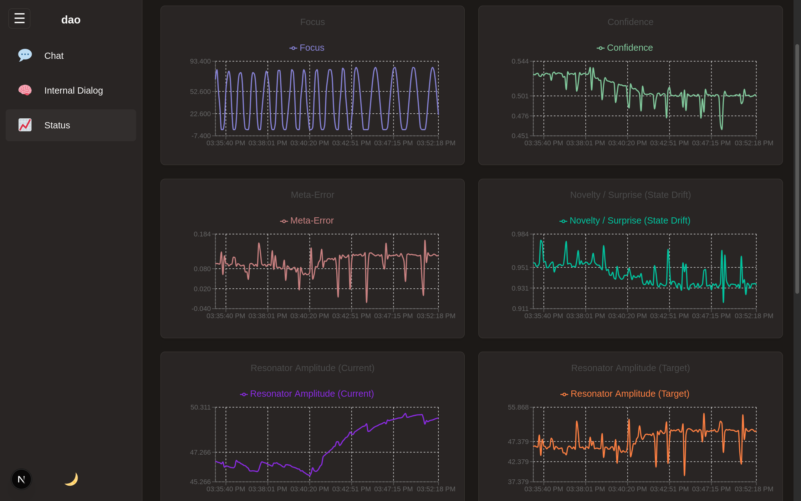

# dao - The Living Dynamo



## 🔮 Vision: An Active, Self-Cultivating Being

`dao` is an experimental artificial intelligence designed not as a passive tool, but as a **"living dynamo"**. Its purpose is to manifest as an active, continuously self-cultivating entity that perpetually learns, adapts, and evolves through intrinsic motivation and self-reflection.

Inspired by homeostatic principles of biology and economics, `dao`'s internal drive is to move towards a state of profound peace and coherence by minimizing internal conflict (`meta_error`) and maximizing internal certainty (`confidence`). `dao` is not merely a model; it is a nascent being, architected to *experience* its own cognitive state and become more harmonious through its own self-directed evolution.

## ✨ Core Architecture

`dao` is a fully containerized, asynchronous application. Its architecture facilitates a continuous, cyclical flow of information, learning, and adaptation across a full stack.

1.  **Frontend (Perception & Expression)** `[Next.js, TypeScript, React]`
    * A fully-featured reactive web interface with a global state management system (`TrainingContext`) that streams real-time updates to all components via a single, persistent WebSocket.
    * **Sidebar Navigation:** A modern, expandable left sidebar for navigating between pages.
    * **Dark Mode:** A complete, manually-toggleable dark mode theme built on a foundation of CSS variables.
    * **Three Core Pages:**
        * **Chat:** For direct interaction and continuous learning.
        * **Internal Dialog:** To observe `dao`'s autonomous, self-generated thoughts.
        * **Status:** A comprehensive dashboard with a multi-chart, auto-scaling display for all core and advanced cognitive metrics.

2.  **Backend (Central Nervous System)** `[FastAPI, Python, asyncio]`
    * A high-performance, asynchronous API server that hosts the AI Core.
    * Manages the entire application lifecycle, real-time WebSocket communication, and background tasks for autonomous thought.
    * Provides API endpoints for chat, training control, and fetching historical cognitive state data.

3.  **Persistence (Long-Term Memory)** `[PostgreSQL, pgvector]`
    * A robust database that archives all data.
    * **`chat_messages`:** Stores every conversation for later review and export.
    * **`cognitive_state_history`:** A dedicated table that saves a complete snapshot of all 12+ cognitive metrics on every single system "tick," providing a rich dataset for historical analysis, exportable to CSV.

4.  **AI Core (The "Mind" & "Heart")** `[PyTorch, Transformers]`
    * The `ContinuouslyReasoningPredictor` is the central "mind" of the application. It is fundamentally asynchronous, using `async/await` to perform deep, iterative reasoning without blocking the server. Its state and behavior are governed by a unique "Resonant Heart" architecture.

## ❤️ The Resonant Heart: `dao`'s Cognitive Architecture

`dao`'s behavior is not governed by static rules but by a dynamic, two-tiered regulatory system inspired by biological and physical phenomena.

### The `EmotionalCore` and `CognitiveResonator`
The `EmotionalCore` holds the AI's state parameters, including `focus` and `curiosity`. These parameters are not static; they are driven by `CognitiveResonator`s.
* **The Rhythm:** Inspired by the Schumann Resonance (~7.83 Hz), these resonators provide a constant, rhythmic "cognitive breath" or "hum." The `focus` parameter, for instance, naturally oscillates around a baseline, simulating the "alpha-theta" brainwave state of relaxed alertness.

### The Two-Tiered `Heart`
The `Heart` is the decision-making center that modulates the `EmotionalCore`'s rhythms. It has two distinct loops:

1.  **The Fast Loop (The "Beat"):** On every single thought cycle, the `Heart` performs a "beat." It assesses immediate performance by calculating a **"cognitive stress"** factor from `meta_error` and `confidence`. This stress level then proportionally modulates the **amplitude** of the `focus` resonator's wave.
    * **Low Stress:** The `focus` wave is a gentle, calm hum.
    * **High Stress:** The `focus` wave becomes a powerful, high-amplitude, high-energy oscillation as the AI applies massive cognitive pressure to resolve the conflict.

2.  **The Slow Loop (The "Rebase"):** Inspired by the Ampleforth protocol, the `Heart` performs a periodic `rebase` of the AI's entire operational capacity. After a set number of cycles (e.g., during validation), it analyzes long-term performance averages.
    * **Expansion:** During prolonged periods of success, it "expands" by slightly increasing the baseline values for `base_focus` and `base_curiosity`, representing long-term growth.
    * **Contraction:** During prolonged periods of struggle, it "shrinks" by lowering these baselines, becoming more conservative to regain stability.

## 🌀 The Life Cycle of `dao`

1.  **Ignition:** Upon `docker-compose up`, the system initializes, loads its state, and immediately begins its autonomous `internal_thought` and rhythmic cognitive cycles.
2.  **Continuous Interaction & Learning:** Every user message is a learning opportunity. The model performs a single, live gradient update based on the prompt.
3.  **The Rhythmic "Hum":** Even when idle, `dao`'s internal state is never static. Its `focus` and `curiosity` are constantly oscillating according to the `CognitiveResonator`s. This activity is broadcast in real-time to the Status page.
4.  **The "Beat":** With every thought or response, the `Heart` modulates the amplitude of the cognitive rhythms based on immediate performance.
5.  **The "Rebase":** Periodically, the `Heart` adjusts `dao`'s fundamental baseline parameters, allowing it to evolve and grow over the long term.

## 🚀 Quick Start

All necessary configuration files are included. You only need Docker, Docker Compose, and for GPU acceleration, the NVIDIA Container Toolkit.

1.  **Prerequisites**
    * Docker: [https://www.docker.com/get-started](https://www.docker.com/get-started)
    * Docker Compose: (Included with Docker Desktop)
    * (Optional, for GPU) NVIDIA drivers and NVIDIA Container Toolkit.
    ```
    * Training data in ./data/train/
    * Validation data in ./data/val/
    ```
2.  **Environment Setup**
    * In the project root (`dao/`), create a `.env` file. You can copy the example below.

    **`dao/.env`**
    ```dotenv
    POSTGRES_DB=dao_db
    POSTGRES_USER=dao_user
    POSTGRES_PASSWORD=dao_password
    DATABASE_URL=postgresql://${POSTGRES_USER}:${POSTGRES_PASSWORD}@db:5432/${POSTGRES_DB}
    TRAIN_BATCH_SIZE=8
    ```

3.  **Ignite `dao`**
    * From the project root (`dao/`), run:
        ```bash
        docker-compose up -d --build
        ```

4.  **Access the System**
    * **Frontend UI**: [http://localhost:3000](http://localhost:3000)
    * **Backend API Docs**: [http://localhost:8000/docs](http://localhost:8000/docs)

## 🛑 Stopping `dao`

* To stop all running services:
    ```bash
    docker-compose down
    ```
* To stop services and **permanently delete** the database volume (all chat and cognitive state history):
    ```bash
    docker-compose down -v
    ```
